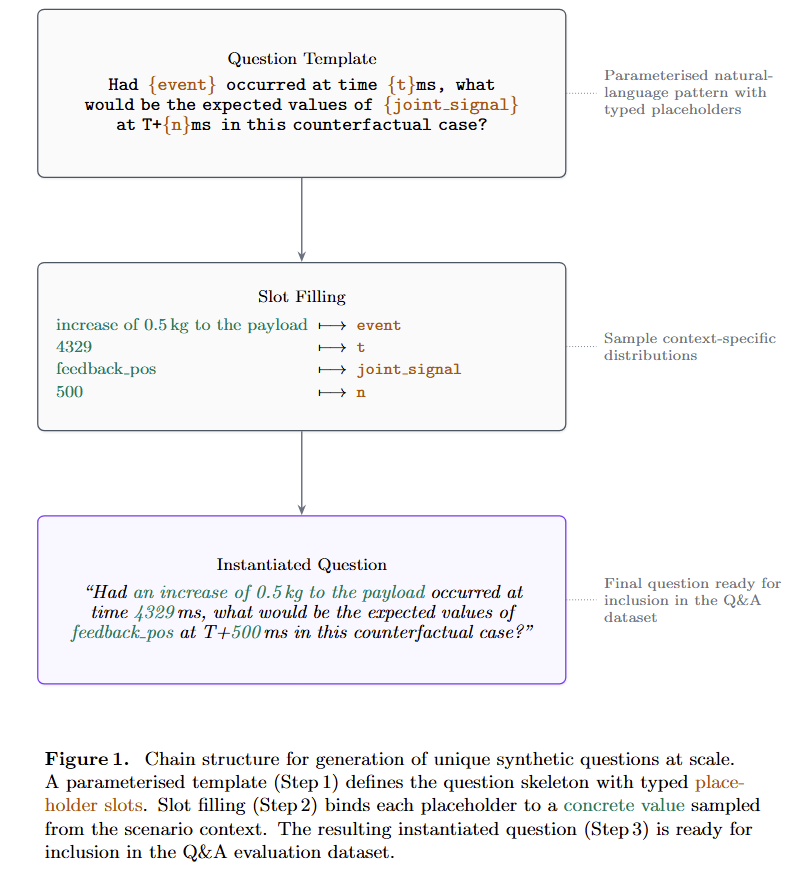

# FactoryBench: Toward Foundation Models for Industrial Machine Understanding

## Abstract

Time-series models are widely used in industrial monitoring tasks such as forecasting, anomaly detection, and signal analysis. While highly effective for these objectives, they are often opaque and limited in their ability to provide structured reasoning for engineering decision-making. Large language models (LLMs), in contrast, can generate coherent, context-aware explanations and support multi-step reasoning. However, general-purpose LLMs still struggle when applied directly to dense multivariate sensor streams and machine-specific diagnostics without adaptation or external tools. A promising direction is therefore to use LLM agents augmented with specialized numerical and signal-processing tools. This raises a central question: how can we verify that these systems truly understand machine behavior rather than only generating plausible text?

We introduce **FactoryBench**, a benchmark for evaluating LLM agents on machine understanding over industrial time-series data. Our contributions are threefold. First, we propose a scalable framework for generating machine-understanding question-answering tasks, built around 80 structured question templates spanning diverse reasoning scenarios. Second, we present **FactoryWave**, a dense multivariate dataset generated from one-armed robotic systems, including both collaborative and industrial manufacturing robots. Third, we construct FactoryBench as a large-scale Q\&A dataset for time-series understanding in LLM agents, grounded in FactoryWave as well as open-source robotics datasets and simulations. Together, these components provide a rigorous testbed for evaluating reasoning, causal understanding, and decision support over real and simulated industrial signals.

# 1 Introduction

Modern industrial systems generate large volumes of multivariate time-series data from sensors, actuators, and controllers. In robotic manufacturing settings, these signals encode joint states, torques, forces, velocities, contact events, task phases, and fault indicators. Extracting actionable knowledge from such data is central to monitoring, diagnostics, anomaly detection, and decision support.

Traditional time-series models excel at narrow tasks such as prediction, classification, and anomaly detection. However, these models are often specialized and difficult to interpret. They typically output labels or numeric predictions without explicit reasoning or higher-level explanations and cannot do much more outside of the specific task they are trained on, which limits their direct utility for automated engineering decision-making.

Large language models, on the other hand, exhibit strong general reasoning abilities and can produce structured explanations in technical contexts [1, 2]. They can integrate textual information, follow logical chains, and generate interpretable outputs. Yet, when applied directly to dense numerical time series, general LLMs still underperform without adaptation. At the same time, transformer-based architectures have become increasingly effective for time-series forecasting and representation learning [3, 4, 5, 6, 7, 8, 9].

A promising paradigm is to build LLM agents equipped with specialized tools, including time-series models and signal-processing modules [10, 11, 12]. These agents can combine language reasoning with domain-specific computation. Nevertheless, evaluating whether such systems truly understand machine behavior remains challenging. Existing benchmarks mostly target textual reasoning, code generation, or generic multimodal understanding [13, 14, 15], leaving a gap in rigorous evaluation for machine-centered, time-series reasoning.

To address this gap, we propose FactoryBench, a benchmark designed to evaluate machine understanding in LLM agents. FactoryBench is grounded in FactoryWave, a dense multivariate time-series dataset collected from one-armed robotic systems, including collaborative and industrial manufacturing robots. The dataset captures rich dynamic behavior under diverse operational conditions.

We also introduce a scalable question-generation framework composed of 80 structured templates spanning a wide range of reasoning types and applicable to general machine data flows. These templates enable systematic construction of question-answering tasks that probe state understanding, intervention reasoning, counterfactual analysis, and decision-making in machine contexts. Using this framework and the FactoryWave dataset, we build FactoryBench, a large-scale Q\&A dataset specifically designed to evaluate time-series understanding and engineering reasoning in LLM agents.

By bridging the gap between general language reasoning and specialized time-series modeling, FactoryBench provides a principled foundation for studying machine-centered intelligence in industrial environments.

# 2 Related Work

## LLM Agents and Tool Use

Recent advances in LLM reasoning include prompting and deliberative strategies (e.g., Chain-of-Thought and Tree-of-Thought) that improve multi-step performance [1, 2], alongside tool-augmented paradigms such as Toolformer and ReAct that enable grounded computation through external modules [10, 11, 12]. These ideas motivate industrial agent design where symbolic reasoning must be combined with numerical workflows.

## Time-Series Learning for Industrial Signals

Time-series modeling has advanced through transformer-based architectures (Informer, Autoformer, FEDformer, PatchTST) [4, 5, 6, 7], strong alternative baselines such as TFT and N-BEATS [19, 20], and critical comparisons against simpler linear models [21]. Foundation-model directions (e.g., Chronos) further explore transfer and zero/few-shot adaptation [8, 9]. In parallel, anomaly and reliability monitoring literature includes OmniAnomaly, USAD, and Deep SVDD [22, 23, 24], with surveys and benchmarks highlighting persistent gaps in interpretability and root-cause actionability [25, 26].

## Causality and Benchmark Gaps

Causal frameworks provide formal tools for interventions and counterfactuals [27, 28, 29], while temporal methods such as Granger causality and modern nonlinear causal discovery support directional reasoning in time series [30, 31]. Existing broad benchmarks (MMLU, BIG-bench, MMMU) [13, 14, 15] and classical time-series resources [16, 17, 18] do not directly evaluate machine-centered reasoning over industrial telemetry. FactoryBench targets this gap by jointly testing temporal interpretation, causal reasoning, and engineering decision support.

# 3 Time Series Data

## SCE Schema

We propose that the dataset structure itself must encode causality. Every episode answers: _"What was the machine told to do, and what did it actually do?"_ FactoryNet organizes all signals into three causal groups:

- **Setpoint:** The controller’s command — target position, velocity, and acceleration per axis.
- **Context:** Physical conditions affecting behavior — payload, temperature, material properties. Split into _static_ (episode metadata) and _dynamic_ (time-series columns).
- **Effort + Feedback:** The machine’s response — motor current (effort), actual position (feedback), vibration, and acoustic emission.

This structure enables a universal fault definition: under healthy operation, Effort is a lawful function of Setpoint. Faults manifest as deviations in the `f(Setpoint) vs Effort` relationship. The dataset provides the paired signals that make this comparison possible; the specific comparison method is what downstream models and benchmarks evaluate.

## Open Source Datasets

To ensure broad applicability and reproducibility, FactoryBench adapts open-source datasets to the SCE schema. In particular, we utilize the Aursad and Vorausad dataset (hopefully more as we go on), which offers diverse industrial scenarios and rich sensor streams, along with anomaly labels (4 and 12 classes respectively). All data are preprocessed to conform to the unified episode structure, facilitating cross-dataset evaluation and benchmarking.

## FactoryWave

FactoryWave is a custom dataset generated from one-arm robotic platforms executing canonical industrial tasks such as screwing and pick-and-place (might add more tasks). Experiments are conducted under varied conditions, including different spatial placements (robot on the floor vs ceiling) and operational settings (different parameters). To rigorously evaluate anomaly detection and reasoning, we systematically inject a comprehensive set of anomalies, reflecting realistic and extensive failure modes encountered in industrial environments.

## Simulations

In addition to physical experiments, we simulate the same robotic systems to generate synthetic time series data. These simulations enable controlled experimentation, ablation studies, and validation of reasoning capabilities across both physical and virtual domains. All simulated episodes are encoded using the SCE schema to ensure consistency with real-world data.

# 4 Q&A generation

## Levels of Understanding

| Answer Format | Level 1: State | Level 2: Intervention | Level 3: Counterfactual | Level 4: Decision |
| ------------- | -------------- | --------------------- | ----------------------- | ----------------- |
| Multi select  | ✓              | ✓                     | ✓                       | ✓                 |
| Scalar        | ✓              | ✓                     | ✓                       | -                 |
| Tensor        | ✓              | ✓                     | ✓                       | -                 |
| Ranking       | ✓              | ✓                     | ✓                       | ✓                 |
| Free form     | ✓              | ✓                     | ✓                       | ✓                 |

To systematically evaluate machine understanding, we organize question-answering tasks according to a four-tier hierarchy, each probing distinct reasoning capabilities:

**Level 1: State.** This tier assesses the agent’s ability to interpret the current state of the machine, including detection of anomalies, identification of operational modes, and recognition of sensor patterns. Questions at this level require accurate extraction and interpretation of time series features.

**Level 2: Intervention.** At this level, the agent must reason about the consequences of interventions or events occurring at the present timestep that might perturb the distribution of machine states. Tasks include predicting the immediate impact of control actions, diagnosing faults as they arise, and understanding causal relationships in real time.

**Level 3: Counterfactual.** This tier evaluates the agent’s ability to reason about hypothetical scenarios, such as the effect of an event or intervention at a previous timestep. Questions require the agent to simulate alternative histories and assess how outcomes would differ under counterfactual conditions, while still considering the history they know.

**Level 4: Decision Making.** The highest tier encompasses complex decision-making tasks, where the agent must generate a sequence of actions or recommendations based on the time series and a prompt. This includes troubleshooting, optimization, and planning, requiring integration of state interpretation, causal reasoning, and goal-directed synthesis.

By structuring Q&A tasks along these four levels, FactoryBench enables rigorous and granular assessment of machine understanding, from basic state recognition to advanced decision support.

## Dataset Diversity & Quality Assurance

A critical risk in template-generated benchmarks is a lack of semantic diversity, leading models to memorize structural patterns rather than perform true reasoning. To ensure our dataset evaluates robust machine understanding, we utilize the **Vendi Score** on the embeddings of our Q&A pairs to measure and maximize effective population diversity.

We iteratively evaluate dataset diversity across three primary axes during generation:

- **Low Diversity (Parameter Variation):** Varying only parameters like time windows and joint indices yields a low Vendi Score, confirming that simple parameter randomization is insufficient.
- **Moderate Diversity (Format Variation):** Semantically identical questions expressed across different formats (Open-ended, Multiple Choice, True/False) measurably increase the effective diversity.
- **High Diversity (Template & Type Variation):** Introducing mixed reasoning templates across levels (e.g., kinematic comparison, derivative estimation such as friction and acceleration, anomaly detection) drives the highest Vendi Score.

By enforcing high Vendi Scores across our generated subsets, we ensure the benchmark tests versatile analytical capabilities rather than surface-level pattern matching.

# 5 Experiment

#

## Experimental Protocol

We evaluate FactoryBench by running the Q&A suite on a set of leading large language models (LLMs), including three to four proprietary benchmark models and two to three open-source alternatives. Each model is assessed on its ability to answer questions spanning all four levels of machine understanding, as defined in Section 4.

To further investigate the impact of domain adaptation, we optionally finetune the open-source models on the FactoryBench Q&A dataset. This enables direct comparison between out-of-the-box and specialized variants, highlighting the benefits and limitations of targeted training.

In addition, we explore tool-augmented agent configurations, wherein the best-performing model is granted access to external time series prediction and anomaly detection modules. This setup allows the agent to query specialized models for numerical reasoning, anomaly localization, and forecasting, thereby testing the synergy between LLM reasoning and domain-specific computation.

## Models to Evaluate

**Frontier LLMs:**
- GPT-4o, GPT-4-Turbo
- Gemini-2.5-Pro, Gemini-2.5-Flash
- Claude-3.5-Sonnet, Claude-3-Opus

**Specialized Methods:**
- Time-series encoders + LLM (Chronos, Moirai)
- Multimodal industrial models (FD-LLM)
- RAG with manual retrieval

**Baselines:**
- Random
- Rule-based (threshold detection)
- Human expert (ceiling)

# 6 Result

# 7 Analysis

POTENTIAL TODO: organize human study on free form answers checked by LLM voting.

# 8 Conclusion

# 9 Appendix

## A.1 Four Levels of Machine Understanding

| Level | Task           | Example Question                                                              | Ground Truth Source        | Commercial Value               |
| ----- | -------------- | ----------------------------------------------------------------------------- | -------------------------- | ------------------------------ |
| **1** | State          | "What's the current of joint 3 now?"                                          | Sensor data                | Fleet monitoring               |
| **2** | Intervention   | "If force in joint 3 suddenly increases _now_ to X, what happens?"            | Simulation (present state) | Diagnostic intervention        |
| **3** | Counterfactual | "If force had suddenly increased to X _at t=20ms_, what would have happened?" | Simulation (past state)    | Root cause / Capacity planning |
| **4** | Decision       | "Robot stopped with error C203A. What to do?"                                 | Manual + sensor fusion     | Expert-free recovery           |

Source for safety, robot, joint modes: https://docs.universal-robots.com/tutorials/communication-protocol-tutorials/rtde-guide.html

---

# References

[1] Wei, J. et al. (2022). _Chain-of-Thought Prompting Elicits Reasoning in Large Language Models_.

[2] Yao, S. et al. (2023). _Tree of Thoughts: Deliberate Problem Solving with Large Language Models_.

[3] Vaswani, A. et al. (2017). _Attention Is All You Need_.

[4] Zhou, H. et al. (2021). _Informer: Beyond Efficient Transformer for Long Sequence Time-Series Forecasting_.

[5] Wu, H. et al. (2021). _Autoformer: Decomposition Transformers with Auto-Correlation for Long-Term Series Forecasting_.

[6] Zhou, T. et al. (2022). _FEDformer: Frequency Enhanced Decomposed Transformer for Long-term Series Forecasting_.

[7] Nie, Y. et al. (2023). _A Time Series is Worth 64 Words: Long-term Forecasting with Transformers (PatchTST)_.

[8] Woo, G. et al. (2024). _Chronos: Learning the Language of Time Series_.

[9] Das, A. et al. (2024). _Time Series Foundation Models and Forecasting: A Survey_.

[10] Schick, T. et al. (2023). _Toolformer: Language Models Can Teach Themselves to Use Tools_.

[11] Yao, S. et al. (2023). _ReAct: Synergizing Reasoning and Acting in Language Models_.

[12] Qin, Y. et al. (2023). _Tool Learning with Foundation Models_.

[13] Hendrycks, D. et al. (2021). _Measuring Massive Multitask Language Understanding (MMLU)_.

[14] Srivastava, A. et al. (2023). _Beyond the Imitation Game: Quantifying and Extrapolating the Capabilities of Language Models (BIG-bench)_.

[15] Yue, X. et al. (2024). _MMMU: A Massive Multi-discipline Multimodal Understanding and Reasoning Benchmark for Expert AGI_.

[16] Laptev, N., Amizadeh, S., and Flint, I. (2015). _Generic and Scalable Framework for Automated Time-Series Anomaly Detection_.

[17] Dau, H. A. et al. (2019). _The UCR Time Series Classification Archive_.

[18] Wen, Q. et al. (2022). _Transformers in Time Series: A Survey_.

[19] Lim, B. et al. (2021). _Temporal Fusion Transformers for Interpretable Multi-horizon Time Series Forecasting_.

[20] Oreshkin, B. N. et al. (2020). _N-BEATS: Neural Basis Expansion Analysis for Interpretable Time Series Forecasting_.

[21] Zeng, A. et al. (2023). _Are Transformers Effective for Time Series Forecasting?_.

[22] Su, Y. et al. (2019). _Robust Anomaly Detection for Multivariate Time Series through Stochastic Recurrent Neural Network (OmniAnomaly)_.

[23] Audibert, J. et al. (2020). _USAD: UnSupervised Anomaly Detection on Multivariate Time Series_.

[24] Ruff, L. et al. (2018). _Deep One-Class Classification_.

[25] Chalapathy, R. and Chawla, S. (2019). _Deep Learning for Anomaly Detection: A Survey_.

[26] Lavin, A. and Ahmad, S. (2015). _Evaluating Real-Time Anomaly Detection Algorithms -- The Numenta Anomaly Benchmark_.

[27] Pearl, J. (2009). _Causality: Models, Reasoning, and Inference_ (2nd ed.). Cambridge University Press.

[28] Peters, J., Janzing, D., and Schölkopf, B. (2017). _Elements of Causal Inference_. MIT Press.

[29] Rubin, D. B. (1974). _Estimating Causal Effects of Treatments in Randomized and Nonrandomized Studies_. Journal of Educational Psychology.

[30] Granger, C. W. J. (1969). _Investigating Causal Relations by Econometric Models and Cross-spectral Methods_. Econometrica.

[31] Runge, J. et al. (2019). _Detecting and Quantifying Causal Associations in Large Nonlinear Time Series Datasets_. Science Advances.
