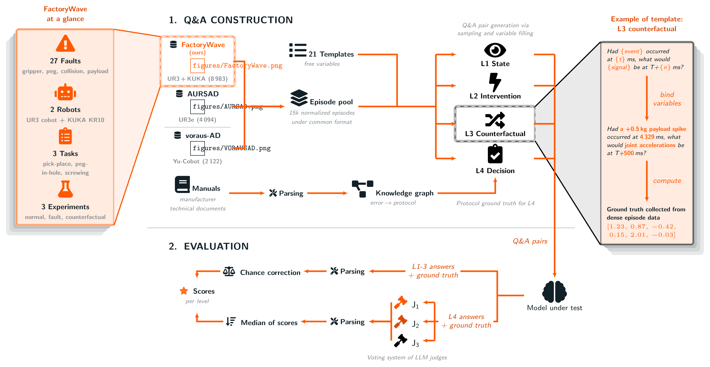
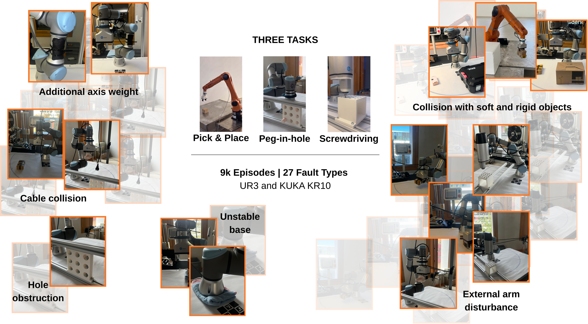

# FactoryBench: Evaluating Industrial Machine Understanding

This project provides FactoryBench, a Q&A benchmark that tests whether AI models can reason about industrial machines -- not just detect anomalies, but understand state, predict interventions, reason counterfactually, and recommend recovery actions.

## FactoryBench: Evaluating Industrial Machine Understanding

[](https://www.forgis.com)
[](https://arxiv.org/abs/2605.07675)
[](https://huggingface.co/datasets/Forgis/FactoryBench)

**Team:** Yanis Merzouki, Coral Izquierdo, Matei Ignuta-Ciuncanu, Marcos Gomez-Bracamonte, Riccardo Maggioni, Alessandro Lombardi, Camilla Mazzoleni, Federico Martelli, Balazs Gunther, Jonas Petersen, Philipp Petersen

We introduce FactoryBench, a benchmark for evaluating time-series models and LLMs on machine understanding over industrial robotic telemetry. Q&A pairs are organized along four causal levels instantiating Pearl's ladder of causation and span five answer formats. We present FactoryWave, a dense multitask multivariate sensor dataset from a UR3 cobot and a KUKA KR10 industrial arm, and construct over 70k Q&A items grounded in roughly 15k normalized episodes. Zero-shot evaluation of six frontier LLMs shows that no model exceeds 50% on structured levels or 18% on decision-making.

Submitted to **NeurIPS 2026 Datasets and Benchmarks Track**.

<p align="center">
  
</p>

<p align="center">
  
</p>

## 4-Level Q&A Framework

| Level | Task | Example | Pearl Rung |
|-------|------|---------|------------|
| **L1** | State | "What is the current of joint 3 now?" | Rung 1 |
| **L2** | Intervention | "If force in joint 3 increases now to X, what happens?" | Rung 2 |
| **L3** | Counterfactual | "If force had increased to X at t=20ms, what would have happened?" | Rung 3 |
| **L4** | Decision | "Robot stopped with error C203A. What to do?" | Composite |

Each level builds on the previous. Failure at Level N implies failure at Level N+1.

## Key Numbers

| | |
|---|---|
| **Q&A items** | 70,000+ |
| **Episodes** | ~15,000 normalized |
| **Question templates** | 21 structured templates |
| **Answer formats** | Multi-select, scalar, tensor, ranking, free-form |
| **Robots** | UR3 cobot + KUKA KR10 |
| **Faults** | 27 types across 3 tasks |

## Quick Start

```bash
pip install datasets
```

```python
from datasets import load_dataset

ds = load_dataset("Forgis/FactoryBench")
```

## Citation

```bibtex
@article{merzouki2026factorybench,
  title   = {FactoryBench: Evaluating Industrial Machine Understanding},
  author  = {Merzouki, Yanis and Izquierdo, Coral and Ignuta-Ciuncanu, Matei
             and Gomez-Bracamonte, Marcos and Maggioni, Riccardo and Lombardi,
             Alessandro and Mazzoleni, Camilla and Martelli, Federico and
             Gunther, Balazs and Petersen, Jonas and Petersen, Philipp},
  journal = {arXiv preprint arXiv:2605.07675},
  year    = {2026}
}
```

## License

Copyright (c) 2026, Forgis Labs. All rights reserved. Licensed under the [Forgis Source Code License (Non-Commercial)](LICENSE.txt).
