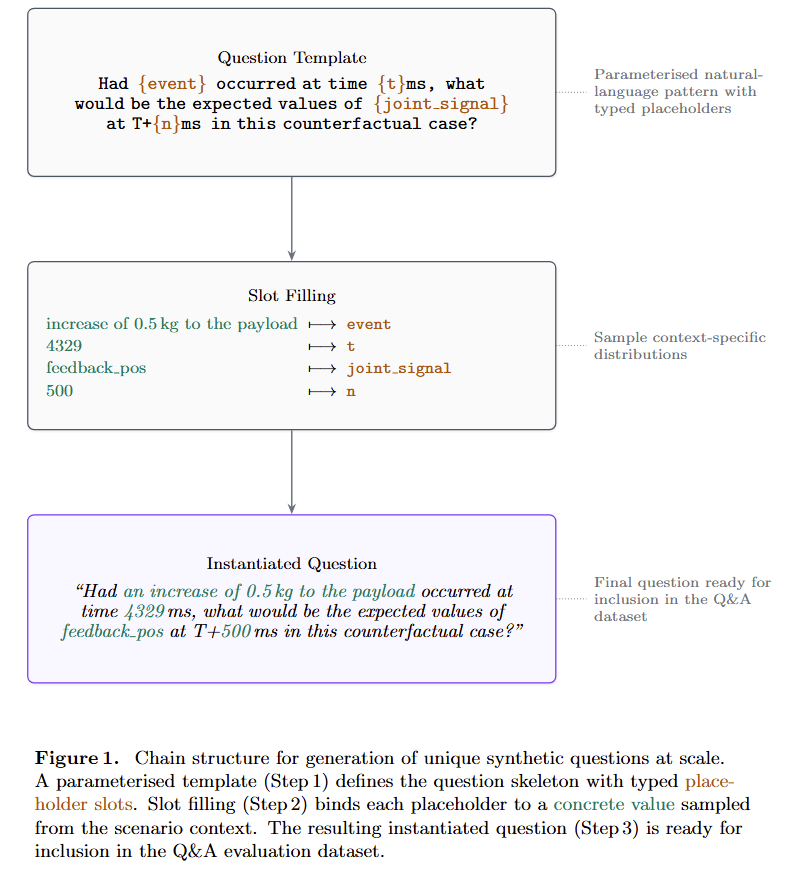

# FactoryBench: Benchmarking Machine Understanding via Question-Answering

**NeurIPS 2026 Datasets and Benchmarks Track**

_Authors: Coral Izquierdo Muniz, Yanis Merzouki, Jonas Petersen, [Additional Authors]_
_Affiliation: Forgis AG, ETH Zurich, [University]_

---

## Abstract

Time-series models are widely used in industrial monitoring tasks such as forecasting, anomaly detection, and signal analysis. While highly effective for these objectives, they are often opaque and limited in their ability to provide structured reasoning for engineering decision-making. Large language models (LLMs), in contrast, can generate coherent, context-aware explanations and support multi-step reasoning. However, general-purpose LLMs still struggle when applied directly to dense multivariate sensor streams and machine-specific diagnostics without adaptation or external tools. A promising direction is therefore to use LLM agents augmented with specialized numerical and signal-processing tools. This raises a central question: how can we verify that these systems truly understand machine behavior rather than only generating plausible text?

We introduce **FactoryBench**, a benchmark for evaluating LLM agents on machine understanding over industrial time-series data. Our contributions are threefold. First, we propose a scalable framework for generating machine-understanding question-answering tasks, built around 80 structured question templates spanning diverse reasoning scenarios. Second, we present **FactoryWave**, a dense multivariate dataset generated from one-armed robotic systems, including both collaborative and industrial manufacturing robots. Third, we construct FactoryBench as a large-scale Q\&A dataset for time-series understanding in LLM agents, grounded in FactoryWave as well as open-source robotics datasets and simulations. Together, these components provide a rigorous testbed for evaluating reasoning, causal understanding, and decision support over real and simulated industrial signals.

---

# 1 Introduction

Modern industrial systems generate large volumes of multivariate time-series data from sensors, actuators, and controllers. In robotic manufacturing settings, these signals encode joint states, torques, forces, velocities, contact events, task phases, and fault indicators. Extracting actionable knowledge from such data is central to monitoring, diagnostics, anomaly detection, and decision support.

Traditional time-series models excel at narrow tasks such as prediction, classification, and anomaly detection. However, these models are often specialized and difficult to interpret. They typically output labels or numeric predictions without explicit reasoning or higher-level explanations and cannot do much more outside of the specific task they are trained on, which limits their direct utility for automated engineering decision-making.

Large language models, on the other hand, exhibit strong general reasoning abilities and can produce structured explanations in technical contexts [1, 2]. They can integrate textual information, follow logical chains, and generate interpretable outputs. Yet, when applied directly to dense numerical time series, general LLMs still underperform without adaptation. At the same time, transformer-based architectures have become increasingly effective for time-series forecasting and representation learning [3, 4, 5, 6, 7, 8, 9].

A promising paradigm is to build LLM agents equipped with specialized tools, including time-series models and signal-processing modules [10, 11, 12]. These agents can combine language reasoning with domain-specific computation. Nevertheless, evaluating whether such systems truly understand machine behavior remains challenging. Existing benchmarks mostly target textual reasoning, code generation, or generic multimodal understanding [13, 14, 15], leaving a gap in rigorous evaluation for machine-centered, time-series reasoning.

To address this gap, we propose FactoryBench, a benchmark designed to evaluate machine understanding in LLM agents. FactoryBench is grounded in FactoryWave, a dense multivariate time-series dataset collected from one-armed robotic systems, including collaborative and industrial manufacturing robots. The dataset captures rich dynamic behavior under diverse operational conditions.

We also introduce a scalable question-generation framework composed of 80 structured templates spanning a wide range of reasoning types and applicable to general machine data flows. These templates enable systematic construction of question-answering tasks that probe state understanding, intervention reasoning, counterfactual analysis, and decision-making in machine contexts. Using this framework and the FactoryWave dataset, we build FactoryBench, a large-scale Q\&A dataset specifically designed to evaluate time-series understanding and engineering reasoning in LLM agents.

By bridging the gap between general language reasoning and specialized time-series modeling, FactoryBench provides a principled foundation for studying machine-centered intelligence in industrial environments.

---

# 2 Related Work

## LLM Agents and Tool Use

Recent advances in LLM reasoning include prompting and deliberative strategies (e.g., Chain-of-Thought and Tree-of-Thought) that improve multi-step performance [1, 2], alongside tool-augmented paradigms such as Toolformer and ReAct that enable grounded computation through external modules [10, 11, 12]. These ideas motivate industrial agent design where symbolic reasoning must be combined with numerical workflows.

## Time-Series Learning for Industrial Signals

Time-series modeling has advanced through transformer-based architectures (Informer, Autoformer, FEDformer, PatchTST) [4, 5, 6, 7], strong alternative baselines such as TFT and N-BEATS [19, 20], and critical comparisons against simpler linear models [21]. Foundation-model directions (e.g., Chronos) further explore transfer and zero/few-shot adaptation [8, 9]. In parallel, anomaly and reliability monitoring literature includes OmniAnomaly, USAD, and Deep SVDD [22, 23, 24], with surveys and benchmarks highlighting persistent gaps in interpretability and root-cause actionability [25, 26].

## Causality and Benchmark Gaps

Causal frameworks provide formal tools for interventions and counterfactuals [27, 28, 29], while temporal methods such as Granger causality and modern nonlinear causal discovery support directional reasoning in time series [30, 31]. Existing broad benchmarks (MMLU, BIG-bench, MMMU) [13, 14, 15] and classical time-series resources [16, 17, 18] do not directly evaluate machine-centered reasoning over industrial telemetry. FactoryBench targets this gap by jointly testing temporal interpretation, causal reasoning, and engineering decision support.

| Benchmark               | Machine/Robot | Multivariate |    Size | Counterfactual | Ranking | Numerical | Free-Form | Novel Dense TS |
| ----------------------- | :-----------: | :----------: | ------: | :------------: | :-----: | :-------: | :-------: | :------------: |
| TimeSeriesExam          |       ✗       |      ✗       |    ~700 |       ✗        |    ✓    |     ✗     |     ✗     |       ✗        |
| ChatTS                  |       ✗       |      ✓       |   ~134k |       ✗        |    ✓    |     ✓     |     ✗     |       ✗        |
| EngineMT-QA             |       ✓       |      ✓       |   ~110k |       ✗        |    ✓    |     ✓     |     ✓     |       ✗        |
| TSAQA                   |       ✗       |      ✗       |   ~210k |       ✗        |    ✓    |     ✗     |     ✗     |       ✗        |
| Time-MQA                |       ✗       |      ✓       |   ~200k |       ✗        |    ✓    |     ✓     |     ✓     |       ✗        |
| MTBench                 |       ✗       |      ✓       |       ? |       ✗        |    ✓    |     ✓     |     ✓     |       ✗        |
| QuAnTS                  |       ✗       |      ✓       |   ~150k |       ✗        |    ✓    |     ✓     |     ✓     |       ✗        |
| **FactoryBench (Ours)** |       ✓       |      ✓       | **TBD** |       ✓        |    ✓    |     ✓     |     ✓     |       ✓        |

---

## 3. FactoryBench Framework

### 3.1 Four Levels of Machine Understanding

(TODO: REPLACE EXAMPLES WITH MORE UP TO DATE ONES)

| Level | Task           | Example Question                                                     | Ground Truth Source        | Commercial Value               |
| ----- | -------------- | -------------------------------------------------------------------- | -------------------------- | ------------------------------ |
| **1** | State          | "What's the current of joint 3 now?"                                 | Sensor data                | Fleet monitoring               |
| **2** | Intervention   | "If force in joint 3 increases _now_ to X, what happens?"            | Simulation (present state) | Diagnostic intervention        |
| **3** | Counterfactual | "If force had increased to X _at t=20ms_, what would have happened?" | Simulation (past state)    | Root cause / Capacity planning |
| **4** | Decision       | "Robot stopped with error C203A. What to do?"                        | Manual + sensor fusion     | Expert-free recovery           |

To systematically evaluate machine understanding, we organize question-answering tasks according to a four-tier hierarchy, each probing distinct reasoning capabilities:

**Level 1: State.** This tier assesses the agent’s ability to interpret the current state of the machine, including detection of anomalies, identification of operational modes, and recognition of sensor patterns. Questions at this level require accurate extraction and interpretation of time series features.

**Level 2: Intervention.** At this level, the agent must reason about the consequences of interventions or events occurring at the present timestep that might perturb the distribution of machine states. Tasks include predicting the immediate impact of control actions, diagnosing faults as they arise, and understanding causal relationships in real time.

**Level 3: Counterfactual.** This tier evaluates the agent’s ability to reason about hypothetical scenarios, such as the effect of an event or intervention at a previous timestep. Questions require the agent to simulate alternative histories and assess how outcomes would differ under counterfactual conditions, while still considering the history they know.

**Level 4: Decision Making.** The highest tier encompasses complex decision-making tasks, where the agent must generate a sequence of actions or recommendations based on the time series and a prompt. This includes troubleshooting, optimization, and planning, requiring integration of state interpretation, causal reasoning, and goal-directed synthesis.

By structuring Q&A tasks along these four levels, FactoryBench enables rigorous and granular assessment of machine understanding, from basic state recognition to advanced decision support.

**Design principle:** Each level builds on previous. Failure at Level N implies failure at Level N+1.

---

### 3.2 Answer Formats

FactoryBench uses three answer formats, chosen to balance evaluation rigor with scalability. Each format supports deterministic scoring (with the exception of free form), has been chosen in order to make questions very easily checkable, but also hard to answer in the absence of correct reasoning.

**Multi-Select True/False.** The model is presented with four independent statements (A–D) about the outcome of an event or intervention, and must classify each as True or False. This format tests whether the model understands the causal consequences of a perturbation across multiple dimensions simultaneously — safety state, tracking error, current draw — without the answer leaking from any single correct choice. Evaluation gives a score of 1 for exact match, 0.5 for 1 mistake and 0 otherwise (random guesser is expected to get 0).

**Ranking.** The model is given four time-series segments or outcomes (A–D) and must order them according to a specified criterion (e.g., severity of deviation, magnitude of a signal). The answer is a permutation string (e.g., `DABC`). This format probes the model's ability to perform relative quantitative reasoning rather than threshold-based classification. Evaluation uses exact-match rate and Kendall's τ rank correlation against the ground-truth ordering.

**Tensor Prediction.** The model must predict at least one specific scalar value — such as the expected sensor reading following an intervention — with no multiple-choice scaffolding. The answer is a list of floating-point numbers (possibly one). This format directly tests quantitative extrapolation from time-series context. Evaluation is done on each scalar separately, and uses mean absolute percentage error (MAPE) and a threshold-based accuracy metric (prediction within ±*k*% of ground truth), with partial points given to all correct scalars given.

---

### 3.3 Time Series Data and Causal Schema (SCE)

To ensure that the dataset structure itself encodes causality, FactoryBench organizes all time-series signals into three causal groups, answering the core question: _"What was the machine told to do, and what did it actually do?"_

- **Setpoint:** The controller’s command — target position, velocity, and acceleration per axis.
- **Context:** Physical conditions affecting behavior — payload, temperature, material properties. Split into _static_ (episode metadata) and _dynamic_ (time-series columns).
- **Effort + Feedback:** The machine’s response — motor current (effort), actual position (feedback), vibration, and acoustic emission.

This structure enables a universal fault definition: under healthy operation, Effort is a lawful function of Setpoint. Faults manifest as deviations in the `f(Setpoint) vs Effort` relationship. The dataset provides the paired signals that make this comparison possible.

This data is sourced from:

- **FactoryWave:** A custom dataset generated from one-arm robotic platforms executing canonical industrial tasks (e.g., pick-and-place) under varied conditions and systematically injected anomalies.
- **Open Source Datasets:** Adapted datasets such as Aursad and Vorausad, offering diverse industrial scenarios and preprocessed to conform to the unified episode structure.

  | Dataset   | Robot | Size | Frequency | Task           | # of Anomaly Types | SCE Compliance |
  | --------- | ----- | ---- | --------- | -------------- | ------------------ | -------------- |
  | AURSAD    | UR3e  | ?    | 100       | Screwing       | 4                  | ✓              |
  | voraus-AD | UR5   | ?    | 100/500   | Pick and Place | 12                 | ✓              |

- **Simulations:** Synthetic time-series data generated from simulated robotic systems to enable controlled experimentation, ablation studies, and validation across both physical and virtual domains.

(TODO: INSERT TABLE TO SUMMARIZE PROPORTIONS OF DATA COMING FROM EACH SOURCE)

---

## 4. Reliable Q&A Generation (Key Contribution)

### 4.1 At scale generation via extensive labelling

Scalable ground-truth generation is the central challenge of any Q&A benchmark grounded in raw sensor data. FactoryBench addresses this by coupling a structured labelling ontology with a context-free grammar (CFG)-style template system, designed by PhD-level experts in robotics. Rather than annotating individual questions by hand, each template is parameterized: concrete values are filled at generation time from the episode data and its associated labels. The context time serie(s) used to fill the variables of the question is sampled uniformly by datasource (sim vs open source vs FactoryWave), dataset (if looking at open source), experiment, difficulty, length and then placement in that order. This yields a combinatorial expansion from a small set of carefully designed templates into a large, diverse question pool.



**Variable sampling.** Each question template contains multiple variable slots that are filled at generation time via variable-specific sampling distributions. Continuous variables — such as signal names, timestamps, prediction horizons, and numerical thresholds — are sampled directly from the episode data or drawn from predefined distributions. Discrete variables — such as tasks, anomaly types, and root causes — are sampled from curated vocabularies. These vocabularies were initially aggregated from the open-source datasets used in FactoryBench, then substantially expanded by PhD-level robotics experts to cover a broader range of operationally realistic scenarios, while remaining fully reproducible for FactoryWave episodes. This separation between template structure and sampled content is what allows a small number of hand-authored templates to generate a large and semantically diverse question pool.

**Template design.** Each of the 40 question templates was manually authored to probe one specific reasoning capability at the appropriate level of the hierarchy, while remaining general enough to admit a wide range of concrete instantiations. Templates are parameterized over episode segments, signal names, event descriptions, timestamps, and predicted values. Answer options for multi-select questions are drawn from a shared pool of verifiable statements, each paired with a rule that can be evaluated deterministically against the time series, given the densely labelled data. This design ensures that ground truth is never imputed or inferred — it is computed directly from labeled episode data — making the benchmark both reliable and fully reproducible.

### 4.2 Density of FactoryWave

(TODO: TALK ABOUT DATA GENERATION FOR ALL LEVELS (ESPECIALLY LEVEL 3), MENTION HOW LABELLING IS COLLECTED AUTOMATICALLY)

### 4.3 Adapting labelling to open datasets and simulations

(TODO: TALK ABOUT HOW LABELLING WAS DONE ON OPEN DATASETS AND SIMULATIONS)

### 4.4 Dataset Diversity & Quality Assurance

(TODO: GENERATE GRAPHS AND ADD PARAGRAPHS ABOUT Q&A DISTRIBUTIONS (LEVEL, DIFFICULTY, ETC))

A critical risk in template-generated benchmarks is a lack of semantic diversity, leading models to memorize structural patterns rather than perform true reasoning. To ensure our dataset evaluates robust machine understanding, we utilize the **Vendi Score** on the embeddings of our Q&A pairs to measure and maximize effective population diversity.

We iteratively evaluate dataset diversity across three primary axes during generation:

- **Low Diversity (Parameter Variation):** Varying only parameters like time windows and joint indices yields a low Vendi Score, confirming that simple parameter randomization is insufficient.
- **Moderate Diversity (Format Variation):** Semantically identical questions expressed across different formats (Open-ended, Multiple Choice, True/False) measurably increase the effective diversity.
- **High Diversity (Template & Type Variation):** Introducing mixed reasoning templates across levels (e.g., kinematic comparison, derivative estimation like friction/acceleration, anomaly detection) drives the highest Vendi Score. By enforcing high Vendi Scores across our generated subsets, we ensure the benchmark tests versatile analytical capabilities.

### 4.5 Pipeline Overview

(TODO: ADD GRAPH OR SCHEMA SUMMARIZING IT)

---

## 5. Experiments

### 5.1 Models to Evaluate

**Frontier LLMs:**

- GPT-4o, GPT-4-Turbo
- Gemini-2.5-Pro, Gemini-2.5-Flash
- Claude-3.5-Sonnet, Claude-3-Opus

**Specialized Methods:**

- Time-series encoders + LLM (Chronos, Moirai)
- Multimodal industrial models (FD-LLM)
- RAG with manual retrieval

**Baselines:**

- Random
- Rule-based (threshold detection)
- Human expert (ceiling)

### 5.2 Experimental Configurations

Beyond out-of-the-box evaluation, we investigate how different interventions improve performance:

- **Finetuning:** We optionally finetune open-source models on the FactoryBench Q&A dataset to establish the limit of specialized training versus general reasoning.
- **Tool-Augmented Agents:** The best-performing foundational models are granted access to external time-series prediction and anomaly detection modules, testing the synergy between LLM reasoning and domain-specific computation.

### 5.3 Results (Expected)

| Level | Random | Current LLMs | Target (w/ prior) | Human Expert |
| ----- | ------ | ------------ | ----------------- | ------------ |
| 1     | 50%    | 85-95%       | 98%               | 99%          |
| 2     | 20%    | 60-75%       | 85%               | 95%          |
| 3     | 10%    | 35-50%       | 70%               | 90%          |
| 4     | 5%     | 15-30%       | 45%               | 80%          |

**Hypothesis:** Semantic priors (ManualsGraph) will show largest gains at Level 4.

---

## 6. Discussion

### 6.1 Why This Benchmark Matters

**For researchers:** First rigorous evaluation of machine understanding across reasoning levels.

**For practitioners:** Quantifies which AI capabilities are ready for deployment as AI engineers.

**For the field:** Defines "machine understanding" operationally via Q&A.

### 6.2 Limitations

- Single machine family (by design, for depth)
- Simulation-to-real gap in synthetic episodes
- Reliane on LLMs-as-Judge for evaluation of Free-Form question

### 6.3 Relation to FactoryNet

This benchmark evaluates on a **subset** of FactoryNet. The full dataset (50k+ episodes, 200k+ Q&A) will be released separately with a focus on _training_ industrial world models, not just evaluation.

(TODO: CONFIRM WE WANT TO KEEP THIS SUBSECTION. NOT SURE IF IT IS FITTING TO SAY THAT)

### 6.4 Marketing Consideration

[Machine render: High-quality 3D visualization of UR3 with sensor data overlays and Q&A examples could serve as compelling visual for the paper and broader communication.]

---

## 7. Conclusion

FactoryBench introduces a systematic approach to evaluating machine understanding via Q&A. By focusing deeply on one machine family and providing reliable answer generation at scale, we enable rigorous comparison of methods across four levels of reasoning—from basic state identification to procedure generation grounded in technical manuals.

Our physical validation protocol closes the loop from benchmark to reality, addressing the fundamental question: can AI systems that excel at industrial Q&A actually help in the real world?

---

# References

[1] Wei, J. et al. (2022). _Chain-of-Thought Prompting Elicits Reasoning in Large Language Models_.

[2] Yao, S. et al. (2023). _Tree of Thoughts: Deliberate Problem Solving with Large Language Models_.

[3] Vaswani, A. et al. (2017). _Attention Is All You Need_.

[4] Zhou, H. et al. (2021). _Informer: Beyond Efficient Transformer for Long Sequence Time-Series Forecasting_.

[5] Wu, H. et al. (2021). _Autoformer: Decomposition Transformers with Auto-Correlation for Long-Term Series Forecasting_.

[6] Zhou, T. et al. (2022). _FEDformer: Frequency Enhanced Decomposed Transformer for Long-term Series Forecasting_.

[7] Nie, Y. et al. (2023). _A Time Series is Worth 64 Words: Long-term Forecasting with Transformers (PatchTST)_.

[8] Woo, G. et al. (2024). _Chronos: Learning the Language of Time Series_.

[9] Das, A. et al. (2024). _Time Series Foundation Models and Forecasting: A Survey_.

[10] Schick, T. et al. (2023). _Toolformer: Language Models Can Teach Themselves to Use Tools_.

[11] Yao, S. et al. (2023). _ReAct: Synergizing Reasoning and Acting in Language Models_.

[12] Qin, Y. et al. (2023). _Tool Learning with Foundation Models_.

[13] Hendrycks, D. et al. (2021). _Measuring Massive Multitask Language Understanding (MMLU)_.

[14] Srivastava, A. et al. (2023). _Beyond the Imitation Game: Quantifying and Extrapolating the Capabilities of Language Models (BIG-bench)_.

[15] Yue, X. et al. (2024). _MMMU: A Massive Multi-discipline Multimodal Understanding and Reasoning Benchmark for Expert AGI_.

[16] Laptev, N., Amizadeh, S., and Flint, I. (2015). _Generic and Scalable Framework for Automated Time-Series Anomaly Detection_.

[17] Dau, H. A. et al. (2019). _The UCR Time Series Classification Archive_.

[18] Wen, Q. et al. (2022). _Transformers in Time Series: A Survey_.

[19] Lim, B. et al. (2021). _Temporal Fusion Transformers for Interpretable Multi-horizon Time Series Forecasting_.

[20] Oreshkin, B. N. et al. (2020). _N-BEATS: Neural Basis Expansion Analysis for Interpretable Time Series Forecasting_.

[21] Zeng, A. et al. (2023). _Are Transformers Effective for Time Series Forecasting?_.

[22] Su, Y. et al. (2019). _Robust Anomaly Detection for Multivariate Time Series through Stochastic Recurrent Neural Network (OmniAnomaly)_.

[23] Audibert, J. et al. (2020). _USAD: UnSupervised Anomaly Detection on Multivariate Time Series_.

[24] Ruff, L. et al. (2018). _Deep One-Class Classification_.

[25] Chalapathy, R. and Chawla, S. (2019). _Deep Learning for Anomaly Detection: A Survey_.

[26] Lavin, A. and Ahmad, S. (2015). _Evaluating Real-Time Anomaly Detection Algorithms -- The Numenta Anomaly Benchmark_.

[27] Pearl, J. (2009). _Causality: Models, Reasoning, and Inference_ (2nd ed.). Cambridge University Press.

[28] Peters, J., Janzing, D., and Schölkopf, B. (2017). _Elements of Causal Inference_. MIT Press.

[29] Rubin, D. B. (1974). _Estimating Causal Effects of Treatments in Randomized and Nonrandomized Studies_. Journal of Educational Psychology.

[30] Granger, C. W. J. (1969). _Investigating Causal Relations by Econometric Models and Cross-spectral Methods_. Econometrica.

[31] Runge, J. et al. (2019). _Detecting and Quantifying Causal Associations in Large Nonlinear Time Series Datasets_. Science Advances.

---

## Apendix

### A.1 Q&A Pair Structure

**Level 2 Example (Intervention):**

```json
{
  "id": "4fabb9ab-e476-48ff-812d-8fc33bb63ac3",
  "level": 2,
  "template_id": 2,
  "template_type": "intervention_outcome",
  "question": "If a continual increase of feedback_tcp_speed_5 lasting 15 timesteps happened at the current timestep (T=4640ms), what would most likely happen next? Answer only with a 4 letter string using F and T to indicate your answers (ie. TFFT to indicate True, False, False, True). Do not output anything else.",
  "options": {
    "A": "No significant effect: safety stays normal and aggregate error increases by <=7%.",
    "B": "Following the event, command and measured TCP motion remain aligned (TCP tracking error increase <=9%).",
    "C": "Following the event, the system remains in normal safety mode throughout the horizon.",
    "D": "Following the event, robot current increases markedly (>=19% above pre-event mean)."
  },
  "answer": "FTTF",
  "provenance": {
    "dataset": "inter_aursad",
    "episode": "experiment_1",
    "subseries_start_index": 131,
    "subseries_length": 62
  },
  "context": {...}
}
```

---

_Document version: 2.0 (fresh start)_
_Last updated: 2026-03-07_
_Archived: v1_causal in /archive/_
